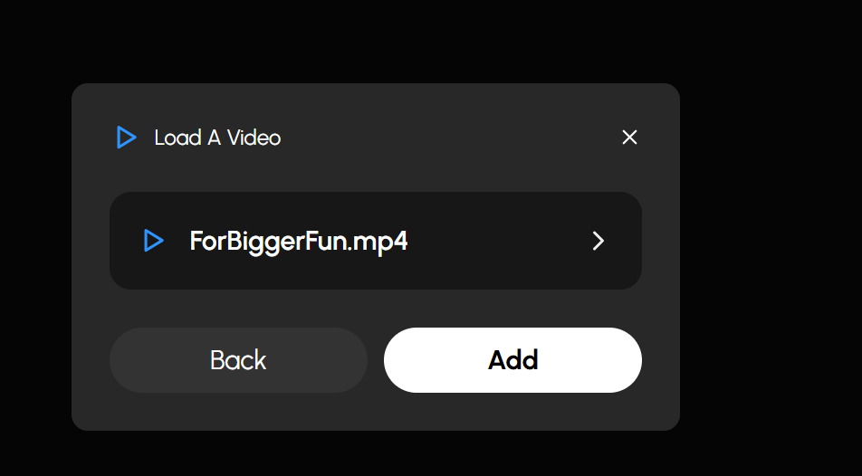

# 🧠 GenAI Mind Map Flow Builder (Gnosis)

**GenAI Mind Map Flow Builder** is a cutting-edge, AI-powered tool designed to convert complex, multi-format data into structured, interactive mind maps. Powered by LLMs like OpenAI GPT-4o and Google Gemini, it allows users to process, query, visualize, and summarize knowledge extracted from diverse sources.

## 📺 Watch Demo on YouTube
[](https://youtu.be/sxvKbQI7Wl0)
---

## 🚀 Key Features

### 🔗 **Multi-Source Data Integration**
- Upload or connect multiple data sources including:
  - Documents, csv, web pages, databases, images, audio, and video
- Add unlimited data sources in one flow
- Reuse and interlink previous answers

### 🧠 **AI-Powered Mind Map Generation**
- Uses OpenAI GPT-4o and Google Gemini to:
  - Extract data insights and visualize them with graph and dataframes (tables)
  - Ask multiple questions on multiple data sources
  - Generate mind maps automatically for single data source
  - Prepare PDF Report for the entire flow

### 🧭 **Two Mind Map Modes**
- **Automatic Mode**:
  - Upload any one source
  - Mind map and summaries are auto-generated with dataframes and graph visualization
- **Manual Mode**:
  - Upload/connect multiple sources as you can
  - AI suggests follow-up questions based on context
  - You can:
    - Ask Answers on follow-up questions
    - Ask your own questions
    - Generate PDF report
  - AI replies in a 3-part format:
    1. 🧾 **Answer**
    2. 📊 **Data Table / DataFrame (if applicable)**
    3. 🌐 **Graph (if applicable)**

### 🔁 **Cross-Source Questioning**
- Ask questions across:
  - Multiple sources
  - Previous AI responses
- Link insights between different data nodes

### 📚 **Mind Map to Report**
- Export entire flow as an AI-generated structured PDF report (Insights will be generated)
- Auto-capture questions, answers, tables, graphs, and source traceability

### 📤 **Export Options**
- Download/share mind maps as images or JSON
- Export complete flow as a detailed report (PDF)
- Print-friendly visualization

---

## 📁 Supported Data Sources

| Category      | Supported Formats |
|---------------|-------------------|
| **Documents**     | `.pdf`, `.docx`, `.txt`, `.md` |
| **Spreadsheets**  | `.csv` |
| **Presentations** | `.pptx` |
| **Images**        | `.jpg`, `.jpeg`, `.png`, `.webp`, `.svg` |
| **Audio**         | `.wav`, `.mp3`, `.aac`, `.ogg`, `.flac`, `.mpeg`, `.aiff` |
| **Video**         | `.mp4`, `.webm`, `.wmv`, `.flv`, `.mov`, `.3gpp`, etc. |
| **Web Pages**     | Web URLs, HTML files |
| **YouTube**       | Public YouTube Video links|
| **Databases**     | SQL (MySQL, PostgreSQL, SQLite), etc

---

## 🖼️ Screenshots

### 🏠 Landing Page


### 📁 Create Flow & Add Sources


### 👤 Choose Agent / Persona


### 🤖 Follow-Up Questions & AI Responses


### ❓ Custom Q&A Interface


### ➕ Add More Sources & Continue Flow


### 🔁 Ask Questions on Previous Responses


### 🧩 Visualize Complete Mind Map Flow


### 🧾 Summarize Complete Flow


### ⚡ Auto Mind Map from PDFs, Videos, and More




---

## 🛠️ Tech Stack

| Layer        | Tech |
|--------------|------|
| **Frontend** | ReactJS, CSS |
| **Backend**  | FastAPI (Python) |
| **AI Models**| OpenAI GPT-4o, Google Gemini Pro, **AWS Bedrock (Claude Sonnet 3.5 + Pegasus)** |
| **Storage**  | Local File System, AWS S3 |
| **Database** | MongoDB, SQLite |
| **Vector Store** | ChromaDB (configurable) |

### 🆕 AWS Bedrock Integration

This application now supports **AWS Bedrock models** as an alternative to OpenAI and Google Gemini:

- **Text Processing**: AWS Bedrock Claude Sonnet 3.5 (instead of OpenAI GPT-4o)
- **Image Analysis**: AWS Bedrock Claude Sonnet 3.5 with vision (instead of Google Gemini)
- **Video/Audio Analysis**: AWS Bedrock Pegasus (instead of Google Gemini)

**Benefits of AWS Bedrock:**
- 🔒 **Enhanced Privacy**: Data stays within AWS infrastructure
- 🏢 **Enterprise Ready**: Role-based access with IAM
- 🌍 **Regional Deployment**: Deploy in your preferred AWS region
- 💰 **Cost Control**: Pay-per-use pricing with AWS billing integration

---

## ⚙️ Setup Instructions

### 🔁 Clone the Repository

```bash
git clone https://github.com/narender-rk10/Gen-AI-MindMap-Flow-Builder.git
cd Gen-AI-MindMap-Flow-Builder
```

### 🔧 Backend Setup (FastAPI + Poetry)

```bash
cd backend
python -m venv .venv
source .venv/bin/activate  # or .venv\Scripts\activate (Windows)

pip install poetry
poetry install
uvicorn app:app --reload
```

### 💻 Frontend Setup (React)

```bash
cd frontend
npm install
npm run dev
```

---

## 🔐 Environment Variables

Create a `.env` file inside the `backend/` folder:

```env
# .env
mongo_db_url=
openai_api_key=
gemini_api_key=
aws_access_key_id=
aws_secret_access_key=
bucket_name=

# AWS Bedrock Configuration (NEW)
AWS_REGION=us-east-1
USE_BEDROCK_ONLY=false  # Set to 'true' to use only AWS Bedrock models
```

> Replace values with actual credentials.

### 🚀 AWS Bedrock Setup

To use AWS Bedrock models exclusively:

1. Set `USE_BEDROCK_ONLY=true` in your `.env` file
2. Ensure your AWS credentials have Bedrock permissions
3. Request access to Claude Sonnet 3.5 and Pegasus models in AWS Bedrock console
4. Deploy on AWS EC2 with IAM role for seamless integration

📖 **Detailed Setup Guides:**
- [AWS Bedrock Migration Guide](backend/BEDROCK_MIGRATION.md)
- [AWS EC2 Deployment Guide](AWS_EC2_DEPLOYMENT.md)

---

## 🧪 Example Workflow

1. Upload a `.pdf`, connect a SQL database, or paste a URL
2. AI reads and summarizes data
3. System builds a visual mind map
4. Ask follow-ups, skip them, or ask custom questions
5. Explore answers (text + table + graph)
6. Export final report as a shareable PDF

---

## 🤖 AI Integration Details

### Default Models (USE_BEDROCK_ONLY=false)
| Model          | Purpose |
|----------------|---------|
| **OpenAI GPT-4o** | NLP, summarization, Q&A, flow generation |
| **Google Gemini Pro** | Multimodal input (text, image, video), deeper analysis |

### AWS Bedrock Models (USE_BEDROCK_ONLY=true)
| Model          | Purpose |
|----------------|---------|
| **Claude Sonnet 3.5** | NLP, summarization, Q&A, flow generation, image analysis |
| **Pegasus** | Video and audio content analysis, YouTube processing |

### Model Comparison

| Feature | OpenAI + Gemini | AWS Bedrock |
|---------|----------------|-------------|
| **Text Processing** | GPT-4o | Claude Sonnet 3.5 |
| **Image Analysis** | Gemini 2.0 Flash | Claude Sonnet 3.5 |
| **Video/Audio** | Gemini 2.0 Flash | Pegasus |
| **Privacy** | Third-party APIs | AWS Infrastructure |
| **Enterprise** | API Keys | IAM Role-based |
| **Deployment** | Any Cloud | AWS Optimized |

---

## 💡 Inspirations

- [NotebookLM (Google)](https://notebooklm.google/)
- [Obsidian Mind Map Plugin](https://obsidian.md/)
- [Miro](https://miro.com/)
- [Whimsical](https://whimsical.com/)
- [Notion AI](https://www.notion.so/product/ai)

---

## 📝 LICENSE:
<a rel="license" href="http://creativecommons.org/licenses/by-nc-nd/4.0/"></a><br />This work is licensed under a <a rel="license" href="http://creativecommons.org/licenses/by-nc-nd/4.0/">Creative Commons Attribution-NonCommercial-NoDerivatives 4.0 International License</a>.

---

## 📬 Contact

📧 **Email**: [narender.rk10@gmail.com](mailto:narender.rk10@gmail.com)

